---

# Programming languages :

 

# Database

# My Projects
### Software

  

### Libs

  
    

  
# My Contributions

<!--  
 -->

  

© 2023 Xenxia, Made with ❤️ for a better web. 

[Cheese-grinder](https://github.com/CheeseGrinder)

